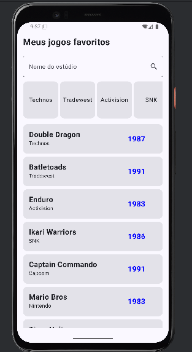
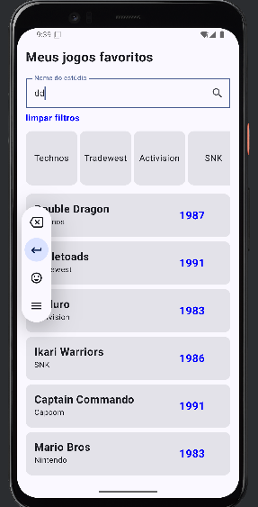
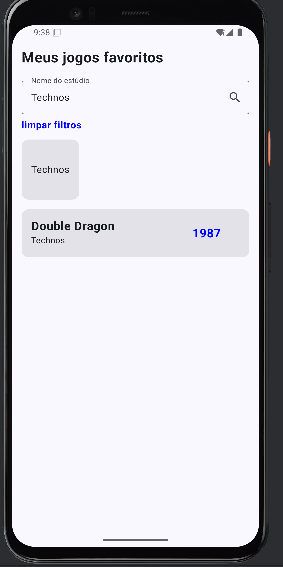

# Checkpoint 5 - Kotlin

* **Grupo:**
    * Guilherme Bezerra Carvalho RM 550282
    * Rodolfo Sanches Cima RM 99748

* **Descrição:** Projeto de estudos dos conceitos de Lazy List, JetPackComposer e filtragem de dados em Kotlin.

---

## Imagens do Projeto

Aqui estão algumas capturas de tela do projeto:

### [Inicio do app]

*Tela inicial do app*

### [Botao limpar filtros]

*Tela após digitar algo no textField, adiciona um botão de limpar filtros.*

### [filtro dos studio cards]

*O que acontece quando clicamos em um dos filtros pré selecionados/a lista de estúdios.*

